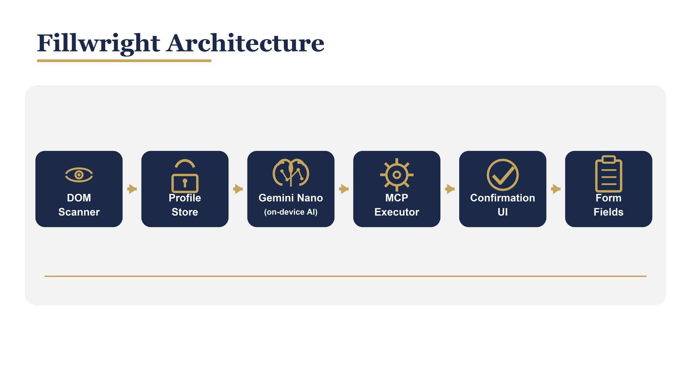

<div align="center">


<br/>

[](#)
[](#testing)
[](#testing)
[](LICENSE)
[](#)

**Local-first. On-device AI. Write a paragraph, fill a form.**

[Quick Start](#quick-start) |
[How to Use](#how-to-use) |
[Architecture](#architecture) |
[Profiles](#managing-profiles) |
[Testing](#testing)

</div>

---

## What is Fillwright?

Fillwright is a **Chrome browser extension** that autofills multi-step forms
using **Gemini Nano**, Google's on-device AI model. Write a paragraph about
yourself and Fillwright extracts your data, maps it to form fields, and fills
them for you. No data ever leaves your device.

| Property | Detail |
|----------|--------|
| **Local-first** | All processing on-device. No cloud, no telemetry, no external calls |
| **On-device AI** | Gemini Nano via Chrome Prompt API. Deterministic fallback when unavailable |
| **Conversational profiles** | Write a paragraph. Fillwright extracts name, email, phone, address, and more |
| **Editable profiles** | Create, edit, switch, delete. Quick (paragraph) or manual (field-by-field) mode |
| **Multi-step wizards** | Detects and navigates multi-step forms, filling each page sequentially |
| **Framework-safe** | Works with React, Vue, Angular, Svelte. Native setter + event dispatch |
| **Encrypted storage** | AES-GCM encryption with PBKDF2 key derivation. Data locked at rest |
| **Confirmation overlay** | Review every change before it touches the DOM. Accept or reject per field |

---

## Architecture

<div align="center">

</div>

<br/>

The framework is structured in five layers:

```
Chrome Extension      Popup UI  |  Content Script  |  Background Worker
                      ─────────────────────────────────────────────────
UI Layer              Confirmation Overlay  |  Profile Selector  |  Profile Create/Edit
                      ─────────────────────────────────────────────────
MCP Executor          fill_field  |  select_option  |  toggle  |  read_validation_errors
                      ─────────────────────────────────────────────────
AI Layer              Gemini Nano (Prompt API)  |  Deterministic Fallback Matcher
                      ─────────────────────────────────────────────────
Core                  DOM Scanner  |  Profile Store (AES-GCM)  |  Text Parser
```

---

## Quick start

### Install as Chrome Extension

```bash
git clone https://github.com/yasserrmd/fillwright.git
cd fillwright
npm install
npm run build:ext
```

Then in Chrome:
1. Open `chrome://extensions`
2. Enable **Developer mode**
3. Click **Load unpacked** and select the `dist/` folder

### Development (Demo Page)

```bash
npm run dev
```

Opens `http://localhost:5173/` with three sample forms.

### Build Commands

| Command | Description |
|---------|-------------|
| `npm run build:ext` | Build the Chrome extension to `dist/` |
| `npm run dev:ext` | Watch mode for extension development |
| `npm run dev` | Demo page with sample forms |
| `npm run build` | Demo page production build |
| `npm run test` | Unit tests (Vitest) |
| `npm run e2e` | End-to-end tests (Playwright) |
| `npm run lint` | Lint source files |
| `npm run typecheck` | Type check without emitting |

---

## How to Use

### 1. Create a Profile

Click the **Fillwright icon** in your Chrome toolbar.

- Click **+** to create a new profile
- Choose **Quick** mode (write a paragraph) or **Manual** mode (fill individual fields)
- Name your profile (e.g. "Personal", "Work", "Partner")
- Click **Save Profile**

**Example paragraph:**

> I am Alice Johnson, a Software Engineer at Acme Corp in the Engineering department.
> My email is alice@acme.com and my phone is +1-555-0123.
> I live at 123 Main Street, Springfield, IL 62701.
> My passport is AB1234567 and my national ID is US-987654321.

Fillwright detects: name, email, phone, address, employer, job title, department, passport, national ID, and custom fields.

### 2. Fill a Form

Navigate to any form page. Click the **Fill Form** button on the page or in the popup. Review changes in the confirmation overlay and accept.

### 3. Switch Profiles

Use the dropdown in the popup to switch between saved profiles. The active profile is used when filling.

### 4. Edit a Profile

Click the **pencil icon** next to the profile dropdown. Modify fields and save.

---

## Managing Profiles

### Profile Modes

| Mode | Description |
|------|-------------|
| **Quick** | Write a paragraph about yourself. Fillwright extracts structured fields automatically |
| **Manual** | Fill individual fields: identity, contact, documents, employment, custom |

### Profile Fields

| Path | Description | Example |
|------|-------------|---------|
| `identity.givenName` | First name | `Alice` |
| `identity.familyName` | Last name | `Johnson` |
| `identity.fullName` | Full name | `Alice Johnson` |
| `identity.preferredName` | Preferred name | `Alice` |
| `contact.email` | Email address | `alice@example.com` |
| `contact.phone` | Phone number | `+1-555-0123` |
| `contact.addresses.N` | Address at index N | `123 Main St, City` |
| `documents.passport` | Passport number | `AB1234567` |
| `documents.nationalId` | National ID | `US-987654321` |
| `documents.emiratesId` | Emirates ID | `784-1234-5678901-2` |
| `employment.employer` | Company name | `Acme Corp` |
| `employment.jobTitle` | Job title | `Software Engineer` |
| `employment.department` | Department | `Engineering` |
| `custom.*` | Any custom field | `custom.nationality: Emirati` |

### Multiple Profiles

Create separate profiles for different contexts and switch between them instantly from the popup dropdown.

### No-Profile Warning

If you click Fill Form without a profile, a modal appears guiding you to create one.

---

## Project Structure

```
fillwright/
  src/
    scanner/              DOM scanning and field schema generation
    mcp/                  WebMCP tool surface and executor
    nano/                 Gemini Nano client, orchestration, fallback, text parser
    store/                Encrypted profile store (AES-GCM + PBKDF2)
    ui/                   Confirmation overlay, profile create/edit/selector
    popup/                Extension popup (HTML, CSS, TS)
    types/                Shared TypeScript types
    content.ts            Content script (injected into pages)
    background.ts         Background service worker
  demo/                   Sample host forms (plain, wizard, locale)
  e2e/                    Playwright end-to-end tests
  docs/                   Architecture, security, limitations, profile template
  icons/                  Extension icons (navy/gold pen nib)
  assets/                 Logo and architecture diagram
```

---

## How It Works

Fillwright follows a **scan, plan, execute, correct** loop:

1. **Scan** -- DOM scanner extracts field schemas (name, type, label, autocomplete, validation), prunes hidden elements, assigns stable IDs
2. **Plan** -- Gemini Nano (or deterministic fallback) reads schemas + profile data and produces a fill plan
3. **Execute** -- MCP executor applies each fill via native setters and framework-compatible event dispatch
4. **Correct** -- Confirmation overlay presents each change for user acceptance before DOM commit

All processing happens on-device. No data is transmitted externally.

---

## Tech Stack

| Layer | Technology |
|-------|-----------|
| **Language** | TypeScript (strict mode) |
| **Build** | Vite (multi-entry: popup, content, background) |
| **Extension** | Chrome Manifest V3 |
| **AI** | Chrome Prompt API (LanguageModel) |
| **Tools** | WebMCP |
| **Storage** | chrome.storage.local + IndexedDB + WebCrypto (AES-GCM) |
| **Unit Tests** | Vitest |
| **E2E Tests** | Playwright |

---

## Testing

```bash
# Unit tests
npm run test

# E2E tests
npm run e2e

# Lint
npm run lint

# Type check
npm run typecheck
```

---

## Documentation

| Guide | Description |
|-------|-------------|
| [Architecture](docs/architecture.md) | Component overview and data flow |
| [Security Model](docs/security.md) | Encryption, key derivation, threat model |
| [Limitations](docs/limitations.md) | Known limitations and browser constraints |
| [Profile Template](docs/profile-template.json) | Sample profile JSON |

---

## Contributing

Contributions are welcome. Follow existing code conventions and ensure all tests pass.

1. Fork the repository
2. Create a feature branch
3. Commit your changes
4. Push and open a pull request

---

## License

Apache-2.0. See [LICENSE](LICENSE).

---

<div align="center">

Built by [YASSERRMD](https://github.com/YASSERRMD)

</div>
